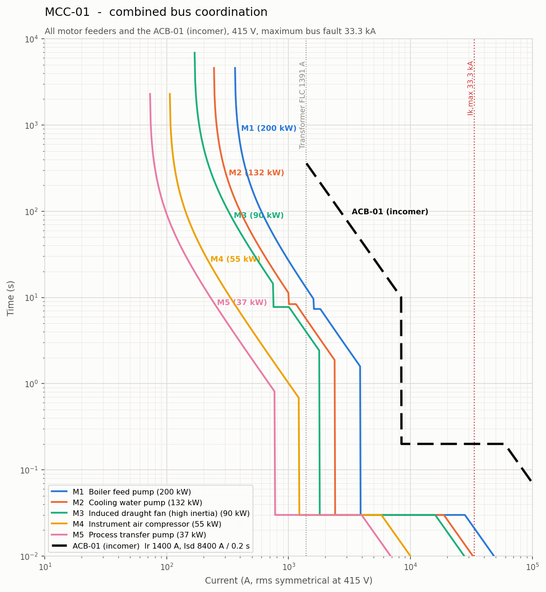
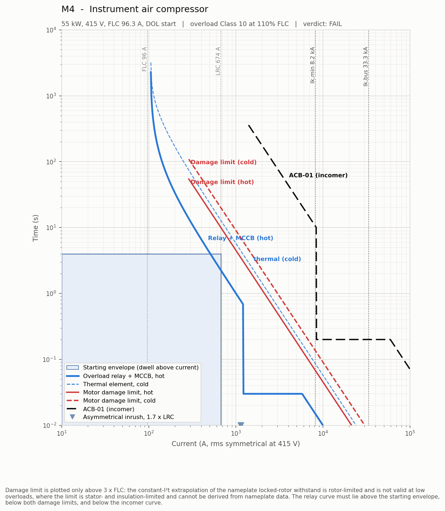
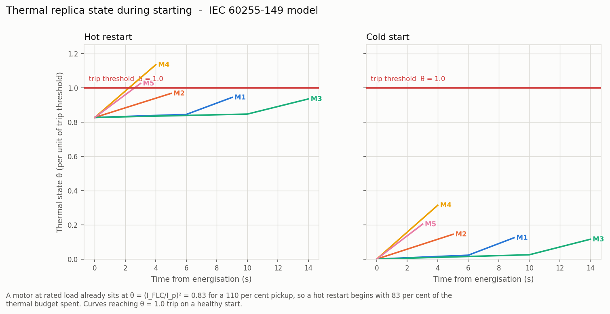

# Motor Protection Coordination & Starting Study — 415 V Industrial Plant Bus

A protection-coordination and motor-starting calculation engine for a low-voltage
industrial switchboard, written in Python. It takes a plant description in YAML and
produces a complete engineering study: short-circuit levels, protection settings with
written justification for every number, time-current characteristic (TCC) plots,
a voltage-dip study, and a pass/fail verdict against nineteen numbered acceptance
criteria drawn from IEC and IEEE standards.

It is a calculation tool — no hardware, no simulated sensors, no invented data. Every
formula carries the standard clause it came from, in the code and in the report. It
publishes three ways: a markdown/PDF report, matplotlib TCC sheets, and a
self-contained interactive viewer, all driven from the same engine.

**[▸ Open the interactive study](https://claude.ai/code/artifact/cd6c09ad-4a01-43b4-beec-c559e4e70fd9)**



---

## What it models

A 1000 kVA, 11 kV/415 V transformer feeding a single 415 V busbar with five induction
motors (37–200 kW) and a static load, each motor protected by the standard IEC starter:
MCCB + contactor + thermal overload relay.

| | |
|---|---|
| **Short circuit** | IEC 60909-0: maximum and minimum duties, transformer correction factor K_T, motor back-feed, peak factor κ |
| **Thermal overload (49/51)** | IEC 60255-149 thermal replica, with τ *derived* from the IEC 60947-4-1 trip class |
| **Locked rotor (51LR)** | Definite-time stall element placed inside a calculated coordination window |
| **Instantaneous (50)** | Set above asymmetrical inrush, below the minimum terminal fault |
| **Starting study** | IEEE Std 399 constant-impedance network solution, DOL and star-delta, alone and with the bus loaded |
| **Cables** | IEC 60228 resistance, IEC 60364-5-52 ampacity and voltage drop, IEC 60364-5-54 adiabatic withstand |

---

## Quick start

```bash
pip install -r requirements.txt
python main.py
```

That writes everything to `output/`:

```
output/
  viewer/index.html  interactive study viewer — open this first
  report.md          the study, ~590 lines, 21 tables
  report.html        same content, self-contained — open and print to PDF
  figures/*.png      single-line diagram, 5 motor TCCs, combined bus TCC,
                     thermal-state chart, voltage-dip chart
  data/*.csv         every result table, for onward use in a spreadsheet
```

### The interactive viewer

`output/viewer/index.html` is a single self-contained file — no server, no build
step, no network dependency beyond a webfont. Open it in any browser.

It is **generated by the calculation engine**, not written alongside it: every number
and every plotted point comes from the same functions that produce the markdown report
and the matplotlib figures. There is no second implementation of the physics in
JavaScript — the browser only draws curves that Python has already sampled, which is
what `tests/test_webexport.py` pins down.

What it adds over the static report:

* **Live TCC curves.** Move the pointer across a chart and a readout bar gives the
  clearing time of *every* curve at that current — relay, thermal, both damage limits
  and the incomer — which is exactly the comparison a coordination study is made of.
  Toggle any series from the legend.
* **A device rail** listing each motor with its verdict, so the board's state reads at
  a glance.
* **Thermal-replica charts** with the trip threshold and the margin band drawn in, and
  the star→delta transition marked.
* **Dip bars** showing each motor's terminal voltage against the 80 % limit.

### Other runs

```bash
python main.py --settings recommended    # apply the tool's own setting search
python main.py --list-scenarios          # show the sensitivity cases
python main.py --scenario weak_source    # run one
python main.py --no-figures              # much faster, skips plotting
python main.py --no-viewer               # skip the interactive viewer
python -m pytest                         # 224 tests
```

The process exits `1` if any check fails, so it can gate a CI job.

---

## How to read the results

### The console summary

```
Tag      kW     FLC  Class   xFLC    51LR   50 (A)  th.hot   Vmot%  Verdict
M1      200   330.0     20   1.10    7.3s     3862   0.944    94.4  MARGINAL
M4       55    96.3     10   1.10    6.3s     1213   1.134    92.9  FAIL
```

* **`th.hot`** is the peak thermal-replica state `θ` reached during a start from the
  hot condition, in per unit of the trip threshold. **`θ ≥ 1.000` means the relay trips
  on a healthy start.** Above 0.90 is flagged marginal.
* **`Vmot%`** is the motor terminal voltage during its own start with every other motor
  running.
* **`51LR`** is the stall-timer setting, or `NONE` if no feasible setting exists.

### Reading a TCC sheet



Current on the x-axis, time on the y-axis, both logarithmic. Four things must be true,
and this sheet shows one of them failing:

1. **The blue device curve must stay above the shaded starting envelope.**
   The envelope is the dwell time the motor actually spends at or above each current
   while accelerating. Here the blue curve drops *into* the envelope from about 215 A
   onwards: at the 674 A locked-rotor current it clears in 2.2 s against a 4 s start, so
   M4's Class 10 relay trips every hot restart.
2. **The device curve must stay below both red damage limits** — the motor's locked-rotor
   withstand, hot and cold.
3. **The device curve must stay below the black incomer curve**, with a coordination
   interval, so a motor fault never trips the whole board.
4. **The instantaneous step must sit between the inrush marker and `Ik,min`** — high
   enough not to trip on starting inrush, low enough to see the weakest terminal fault.

The dotted verticals mark full-load current, locked-rotor current, and the minimum and
maximum fault currents, so the operating region is visible at a glance.

### The thermal-state chart



This is the figure that decides the settings, and it is worth understanding.

A relay's thermal replica integrates heat; it does not compare a single current against
a curve. A motor running at rated load already sits at `θ = (I_FLC/I_p)² = 0.83` for a
110 % pickup — **83 % of its thermal budget is spent before a restart even begins.**
So the binding case is the *hot restart*, not the cold start, and the two panels differ
dramatically: from cold every motor is comfortable; from hot, M4 and M5 cross the trip
threshold.

The flat opening segments on M1 and M3 are the star stage of their star-delta starters —
one third of the current, one *ninth* of the heating rate. A naive curve overlay cannot
see that, which is why the start-up check here is a numerical integration.

### Verdicts

| | |
|---|---|
| `PASS` | meets the criterion with margin |
| `MARGINAL` | meets it, but with less margin than good practice wants — read the note |
| `FAIL` | does not meet the criterion; the report states the remedy |
| `INFO` | not a fault, but a decision that should be recorded (e.g. an oversized cable) |
| `n/a` | the check does not apply (e.g. star-stage stall on a DOL motor) |

---

## What the study actually finds

Run against the as-specified settings, the base case is an **audit that fails**, which is
the point — the numbers were chosen the way they often are in practice, and the tool
catches what that misses:

* **M4 and M5 trip on every hot restart** (θ = 1.134 and 1.025). They are fine from cold,
  which is exactly why this class of fault survives into commissioning and shows up as
  "the compressor won't restart on a hot day".
* **All five motors need the overload pickup at 115 % FLC**, not 110 %, to leave any
  hot-restart headroom.
* **M3, a high-inertia ID fan, has no setting with a full margin.** Raising the pickup to
  survive the hot restart slows the thermal element past the rotor's withstand for a stall
  held in the star stage. The tool reports the conflict rather than trading one failure for
  another, and recommends a restart-inhibit timer.
* **The switchboard has only 7 % margin** — 33.33 kA against a 36 kA rating, once the
  19.6 % motor back-feed is included. A 50 kA board is the recommendation.
* **The worst bus inrush comes from M2, not from the larger M1**, because M1's star-delta
  starter draws a third of the line current a smaller DOL machine does.

`python main.py --settings recommended` re-runs with the searched settings and clears
every failure.

### On the voltage-dip results

Every voltage check passes, and the report says why rather than leaving it as a bare tick.
On an LV bus the motor's own locked-rotor impedance dominates the starting circuit — for
M1 it is 112 mΩ against 9.3 mΩ of source and 5.6 mΩ of cable. The terminal voltage during
a start is therefore set mainly by the machine itself, and the supply can be weakened a
long way before the 80 % criterion binds.

So the report computes **how far**: the transformer would have to shrink from 1000 kVA to
469 kVA before M1's DOL start breaches 80 %. That turns "it passed" into a quantified
margin. **On this class of installation the binding constraints are thermal, not
voltage** — a fact worth knowing before spending money on a soft starter that solves a
problem the plant does not have.

---

## Engineering decisions worth defending

These are the points where an easy implementation would have been wrong.

**The start-up check is an integration, not a curve overlay.** Comparing the relay curve
against the locked-rotor current point compares a steady current against a curve, while
the real relay integrates heat through a *changing* current. That approach cannot see
that a star-delta start deposits one ninth the heat per second during its star stage.

**τ is derived, not assumed.** IEC 60947-4-1 defines a trip class as the cold tripping
time at 7.2 × I_e. Substituting that point into the thermal replica gives
`τ = C / ln(7.2²/(7.2²−1)) = 51.32 C`, so Class 10 → 513 s. A test asserts the curve
reproduces its own trip class, which would fail immediately if τ were invented.

**A motor's own back-feed does not flow through its own protective device.** For a fault
at a motor's terminals the machine feeds the fault from the *load* side. Including it
would overstate the current available to operate the instantaneous element — the wrong
direction for a sensitivity check. The total at the fault point is reported separately,
because that is what the cable and the arc see.

**Conductor temperature is chosen per duty.** 20 °C for maximum fault current (equipment
rating), 90 °C for minimum fault current and voltage drop (protection sensitivity). The
ratio is 1.2751 — a bigger effect than skin effect at these cross-sections.

**The damage curve is only checked where it is valid.** The constant-I²t extrapolation of
the nameplate locked-rotor withstand is *rotor*-limited and meaningless at low overloads,
where the limit is stator- and insulation-limited and cannot be derived from nameplate
data. The check is applied only above 3 × FLC, and the report says so.

**Complex arithmetic throughout.** Network reduction uses admittance summation, never
addition of magnitudes: the network X/R is about 5 while an LV motor is 2.4, so the
contributions do not add in phase. A test asserts the correct answer differs from the
naive one.

**Vendor data is tagged, not hidden.** Values that are not from a standard — transformer
test figures, cable reactance and ampacity, motor run-up and stall times — are marked
`VENDOR` in the YAML and listed in a provenance table in the report. Motor run-up and
stall withstand times are flagged as the most sensitive inputs in the study, because every
protection setting depends on them.

---

## Project layout

```
data/plant.yaml        plant definition, criteria and sensitivity scenarios
data/cables.yaml       copper/XLPE cable library, 4–240 mm²
src/constants.py       every standard constant, with its citation
src/models.py          Source, Transformer, Cable, Motor, FeederBreaker, Plant
src/shortcircuit.py    IEC 60909-0 fault calculation
src/protection.py      thermal replica, setting design and search, checks C1–C9
src/starting.py        voltage-dip network solution, checks C10–C11
src/checks.py          cable and plant-level checks C12–C19
src/plots.py           TCC sheets, SLD, thermal and dip charts
src/report.py          markdown, self-contained HTML and CSV output
src/webexport.py       samples the engine into the interactive viewer's payload
web/template.html      the viewer: tokens, layout and the SVG chart code
main.py                CLI
tests/                 224 tests
```

Nothing in the study is pre-computed in the input file. Full-load currents, cable
impedances, locked-rotor impedances, fault levels and every protection setting are
derived by the code from the physical quantities in `plant.yaml`.

### Changing the plant

Edit `data/plant.yaml` and re-run. To add a motor, copy a block and give it a unique tag;
the cable must be a size present in `data/cables.yaml`. Acceptance thresholds live under
`criteria:`, so the study can be re-run against a client specification with different
limits. Sensitivity cases are dotted-path overrides under `scenarios:`:

```yaml
scenarios:
  weak_source:
    description: Plant running on the 630 kVA standby transformer.
    overrides:
      transformer.kva: 630.0
      motors.M1.start_method: dol
```

---

## Testing

```bash
python -m pytest            # 224 tests
```

The suite is built on one principle: **a check that cannot fail is worthless.** Each of
the nineteen acceptance checks is exercised twice — once against the base case where its
verdict is known, and once against a plant deliberately broken in the specific way that
check exists to catch. Alongside those:

* **Anchors against first principles** — the infinite-source bus fault must equal
  `I_FLC / Z_pu` = 27 824 A; the thermal curve must reproduce its own IEC trip class; κ
  must stay within its physical bounds of 1.02 to 2.0.
* **Limiting cases** — a zero-impedance source cannot dip; a zero-length cable puts the
  motor at bus voltage; θ must saturate at `(I/I_p)²`.
* **Monotonicity** — every effect must point the right way: longer cables deepen dips and
  weaken faults, higher LRC deepens dips, hot curves are always faster than cold.
* **Internal consistency** — the closed-form trip time and the numerical integration are
  two views of the same differential equation and must agree; `S = √3·V·I` must match
  `S = P/(η·pf)`.

---

## Limitations

Stated plainly, because a study that hides its assumptions is not defensible.

* **Three-phase symmetrical faults only.** No earth-fault, phase-phase or arc-flash study.
  For a Dyn11 transformer the LV earth-fault level needs the zero-sequence network, which
  is not modelled.
* **The starting study is quasi-static.** The motor is a constant impedance at standstill,
  which is valid and standard for voltage-dip work, but there is no torque-speed
  integration — run-up times are inputs from a motor/load study, not outputs.
* **No transformer inrush, no load-flow, no harmonics, no cable charging.**
* **Type-2 coordination is checked by breaking capacity only.** Full IEC 60947-4-1 type-2
  verification requires the manufacturer's tested starter combination tables; the tool
  flags the requirement rather than claiming compliance.
* **Vendor-tagged inputs are representative, not project data.** Replace them from the
  transformer test certificate, motor datasheets and cable schedule before using any
  result for construction.

---

## Standards referenced

IEC 60909-0:2016 · IEC 60947-2 · IEC 60947-4-1:2018 · IEC 60255-149 · IEC 60364-5-52 ·
IEC 60364-5-54 · IEC 60364-4-41 · IEC 60228 · IEC 60034-1 · IEC 60034-12 · IEC 61439-1 ·
IEEE Std 242 (Buff Book) · IEEE Std 399 (Brown Book)

Clause-level citations sit next to each formula in `src/constants.py` and in Appendix A
of the generated report. Where a citation is to a chapter rather than a clause, it is
written that way deliberately rather than guessed at.
